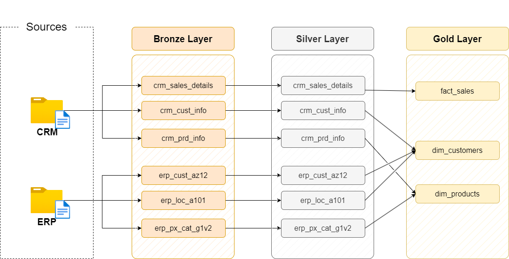
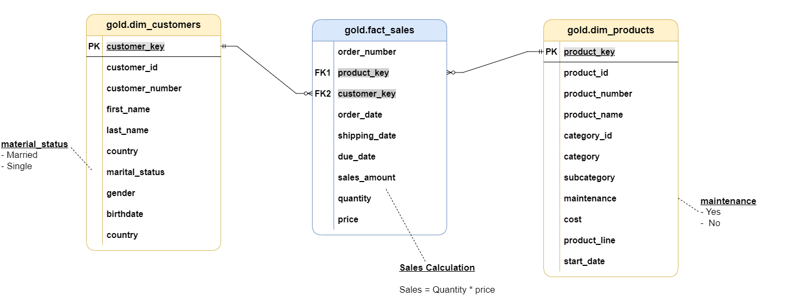

# Data Warehouse and Analytics Project

Welcome to the **Data Warehouse and Analytics Project** repository!

This project demonstrates an end-to-end data warehousing and analytics solution using **Microsoft SQL Server**. It covers the complete workflow from data ingestion and ETL processes to dimensional modeling and analytical reporting. 

The project follows industry best practices in **Data Engineering**, **Data Warehousing**, and **Business Intelligence**, making it an ideal showcase of a modern, scalable data architecture.

---

## Data Architecture

The solution follows a structured 3-tier architecture (inspired by the Medallion Architecture), mapping raw source data into a business-ready analytical model:



### 1. Staging Layer (Raw Data)
* **Purpose:** Serves as the landing zone for all source data.
* **Function:** Imports raw CSV files from **ERP** and **CRM** systems directly into SQL Server without modification.

### 2. Integration Layer (Data Cleaning & Transformation)
* **Purpose:** Cleanses, standardizes, and transforms the raw data.
* **Function:** Removes duplicates, resolves data quality issues, handles missing values, and integrates disparate formats from the ERP and CRM systems to prepare them for analytical processing.

### 3. Warehouse Layer (Star Schema)
* **Purpose:** Stores the final, business-ready data.
* **Function:** Implements a highly optimized **Star Schema** using Fact and Dimension tables. This layer is specifically designed to power reporting, dashboards, and complex analytical queries.



---

## 🎯 Project Objectives

### Data Engineering
Develop a modern data warehouse using **Microsoft SQL Server** to consolidate sales data from multiple source systems into a single analytical database.

**Key Specifications:**
* **Data Sources:** Ingest raw CSV datasets from both ERP and CRM systems.
* **ETL Pipelines:** Build robust SQL-based ETL scripts to extract, transform, and load the data.
* **Data Quality:** Perform comprehensive data cleansing and standardizations.
* **Modeling:** Design and implement a user-friendly dimensional data model (Star Schema).
* *Note: The scope of this project focuses on loading the latest available data (historical tracking/SCD is out of scope).*

### Data Analysis & Reporting
Develop SQL-based analytical solutions to generate actionable business insights.

**Analytics Areas:**
* Customer Behavior Analysis
* Product Performance Analysis
* Sales Trend Analysis

**Business Outcomes:**
* Enable data-driven decision-making.
* Monitor sales performance and KPIs.
* Support customer segmentation and product evaluation.

---

## 💻 Technologies Used

* **Database:** Microsoft SQL Server
* **Language:** T-SQL
* **Concepts:** ETL, Data Warehousing, Star Schema, Dimensional Modeling
* **Version Control:** Git & GitHub

---

## 📂 Repository Structure

```text
Sql-data-warehouse-project/
│
├── datasets/                   # Raw source data
│   ├── CRM/                    # CRM data files (cust_info, prd_info, sales_details)
│   └── ERP/                    # ERP data files (CUST_AZ12, LOC_A101, PX_CAT_G1V2)
│
├── docs/                       # Project documentation and visual diagrams
│   ├── data_catalog.md
│   ├── data_flow.png
│   ├── data_integration.png
│   └── data_model.png
│
├── scripts/                    # SQL scripts for the ETL process
│   ├── staging/                # Database and table creation, raw data insertion
│   ├── integration/            # Data transformation and cleaning scripts
│   └── warehouse/              # Fact and Dimension table creation (Star Schema)
│
├── LICENSE                     # Project license
└── README.md                   # Project overview and documentation
